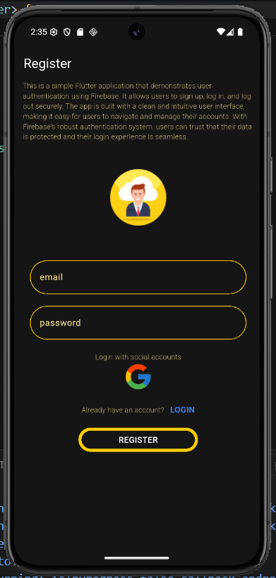
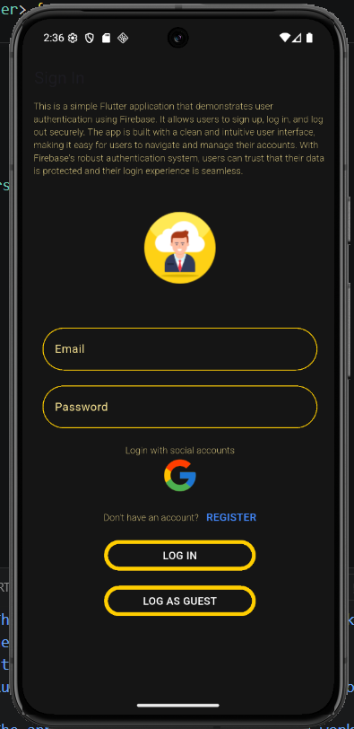
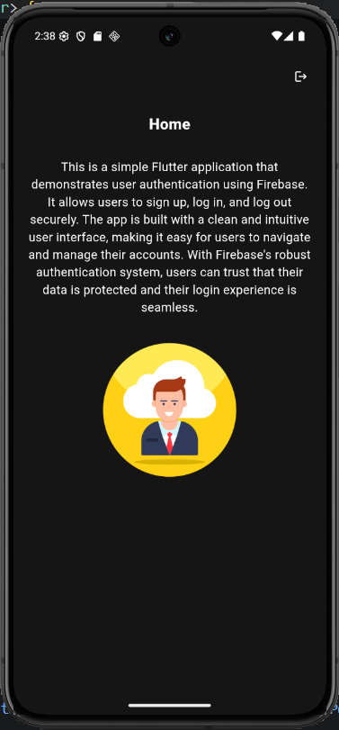

# Firebase Flutter Auth

A complete, production-ready Flutter authentication flow integrated with Firebase. This project provides a robust foundation for building apps that require user authentication, featuring a clean UI and solid state management.

## ✨ Features

- **Email & Password Authentication**: Secure user registration and login flows.
- **Anonymous Sign In**: Allow users to explore as a guest before committing to an account.
- **State Management**: Utilizes the `provider` package to efficiently handle and listen to authentication state changes across the app.
- **Clean Architecture**: Separation of concerns between UI components (`screens/`) and backend logic (`services/`).
- **Production Ready**: Fully adheres to Flutter linting rules with zero warnings.

---

## 📸 Screenshots

> **How to add your images:** 
> 1. Take screenshots of your app running (Register, Sign In, Home).
> 2. Save them in the newly created `assets/screenshots/` folder in your project root.
> 3. Name them `register.png`, `signin.png`, and `home.png` respectively (or update the file names in the code below!).

<p align="center">
  
  &nbsp;&nbsp;&nbsp;&nbsp;
  
  &nbsp;&nbsp;&nbsp;&nbsp;
  
</p>

---

## 🚀 Getting Started

### Prerequisites
- Flutter SDK (`^3.12.2` or later)
- Firebase CLI installed and configured
- An active Firebase project

### Installation

1. **Clone the repository:**
   ```bash
   git clone <your-repository-url>
   ```

2. **Install dependencies:**
   ```bash
   flutter pub get
   ```

3. **Configure Firebase:**
   Ensure your `firebase_options.dart` is correctly configured for your Firebase project. If you haven't done this, run:
   ```bash
   flutterfire configure
   ```

4. **Run the app:**
   ```bash
   flutter run
   ```

---

## 🛠️ Tech Stack
- **Framework:** [Flutter](https://flutter.dev/)
- **Backend:** [Firebase Authentication](https://firebase.google.com/docs/auth)
- **State Management:** [Provider](https://pub.dev/packages/provider)

## 🤝 Contributing
Contributions, issues, and feature requests are welcome! Feel free to check the issues page.
